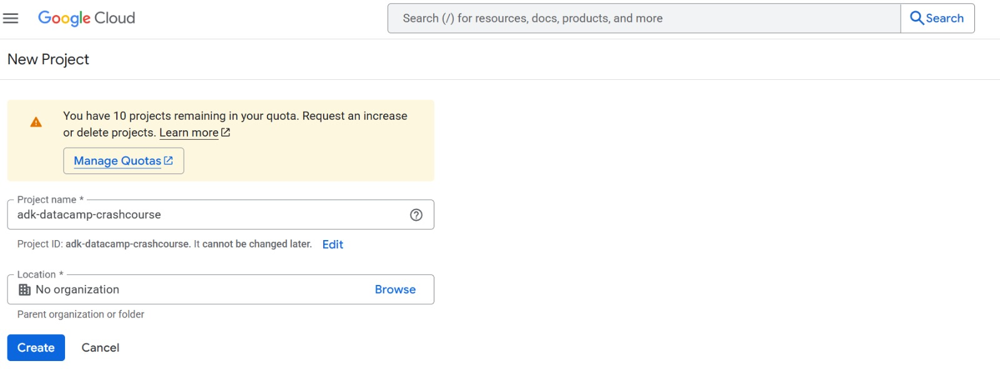
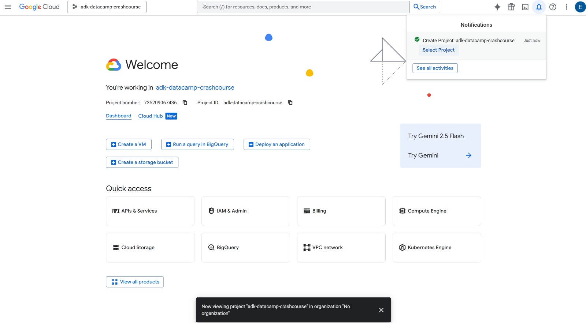
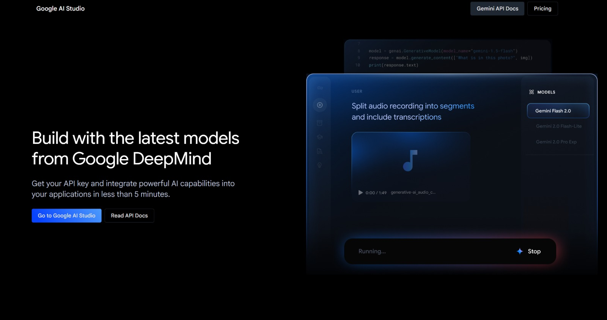
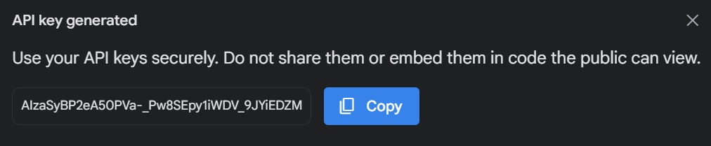

# Introduction

Welcome to the tutorial😊!

## What is Google ADK?

**Google ADK** (Agent Development Kit) is an open-source, code-first Python toolkit for building, evaluating, and deploying sophisticated AI agents with flexibility and control!

Unlike other agent frameworks, ADK gives you **fine-grained control** when building advanced AI agents that are tightly integrated with services in Google Cloud.

In simple words, it allows us to define agent behavior, orchestration, and tool use directly in code, enabling robust debugging, versioning, and deployment anywhere.

### What makes it different to other frameworks?

**Google ADK** stands out from other agent frameworks in several key ways:

- 🎯 **Google Cloud Native**: Unlike LangChain, CrewAI, or AutoGen, ADK is specifically designed for tight integration with Google Cloud services (Vertex AI, Cloud Run, etc.)

- 💻 **Code-First Approach**: While LangGraph focuses on graph-based workflows and CrewAI emphasizes role-based agents, ADK prioritizes direct Python code control for agent behavior and orchestration

- 🚀 **Deployment Ready**: ADK includes built-in deployment capabilities to Google Cloud, while others require additional infrastructure setup

- 🎨 **Simpler Architecture**: Compared to LangChain's complex chains or AutoGen's multi-agent conversations, ADK offers a cleaner, more straightforward approach to building agents

## Agents

_Image taken from Google_

This image shows all of the different agents we can create. Some agents:

1. Have looping functionalities
2. Have reasoning abilities
3. Can execute tasks alongside other agents
4. Have access to tools

The most important thing to note here is that these agents extend the BaseAgent Class.

There are 3 sub-categories of these agents:

1. 🤖 **LLM-Based Agents** (LlmAgent, Agent): Uses LLMs as the base model for natural language understanding and reasoning. [Documentation →](https://google.github.io/adk-docs/agents/llm-agents/)

2. 🔄 **Workflow Agents** (SequentialAgent, ParallelAgent, LoopAgent): Controlled execution flow of other agents in predefined patterns. [Documentation →](https://google.github.io/adk-docs/agents/workflow-agents/)

3. ⚙️ **Custom Agents**: Built by extending BaseAgent for unique, tailored implementations - specific to you! [Documentation →](https://google.github.io/adk-docs/agents/custom-agents/)

# How to get started!

Start of by following the below steps:

1. Go to Google Cloud Console and create a new project:

2. Then select this project in your console:

3. Head over to Google AI Studio:

4. Create an API Key - this is to give you access to Gemini Models (free tier - no credit card needed)!

5. Copy the API key and place in your `.env` file

6. Clone this GitHub repository

7. Pip install the `requirements.txt` file

8. All set 🚀!
