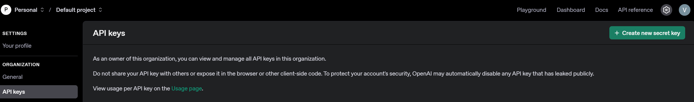

# Sequential Agents

We can use other LLM providers too!

To do this we will be using LiteLLM (we have already installed these from the requirements.txt file). If you haven't you can run this command:

```
pip install litellm
```

We will be using OpenAI model for this example, so you need to obtain your own OpenAI API key and place this in your `.env` file.

To do this go into the [OpenAI Platform](https://platform.openai.com/settings/organization/api-keys)



If you want more information, go here: [https://google.github.io/adk-docs/agents/models/#using-cloud-proprietary-models-via-litellm](https://google.github.io/adk-docs/agents/models/#using-cloud-proprietary-models-via-litellm)
