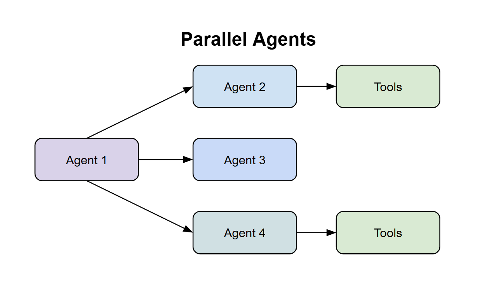

# Parallel Agents

🔄 **What they are**: Agents that work simultaneously, all at the same time

⚡ **How they work**: Multiple agents run in parallel and complete their tasks independently

🎯 **Why use them**: Speed up complex tasks by doing multiple things at once

📋 **Example**: Travel planning system with 3 agents:

- Hotel agent searches for accommodation options
- Restaurant agent finds dining experiences
- Activities agent discovers things to do

✨ **Result**: Faster completion and comprehensive results from multiple sources

**TLDR:** Think of them as agents working side by side!

### Homework:

To really consolidate this, I want you to take our Parallel Agent, and then add another agent at the end of it that takes in all of the 3 inputs and summarizes everything to the user. It should look like this diagram:

