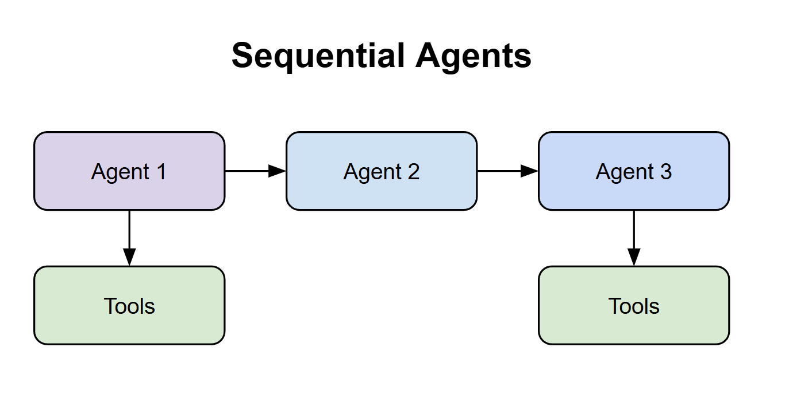

# Sequential Agents

🔗 **What they are**: Agents that work in a chain, one after another

⚡ **How they work**: Each agent passes its output to the next agent

🎯 **Why use them**: Break complex tasks into simple, manageable steps

📋 **Example**: Recipe system with 3 agents:

- Research agent finds ingredients and methods
- Creator agent writes the recipe
- Enhancement agent adds tips and variations
- **Result**: More detailed and sophisticated output than a single agent

**TLDR:** Think of them as a chain of agents!
