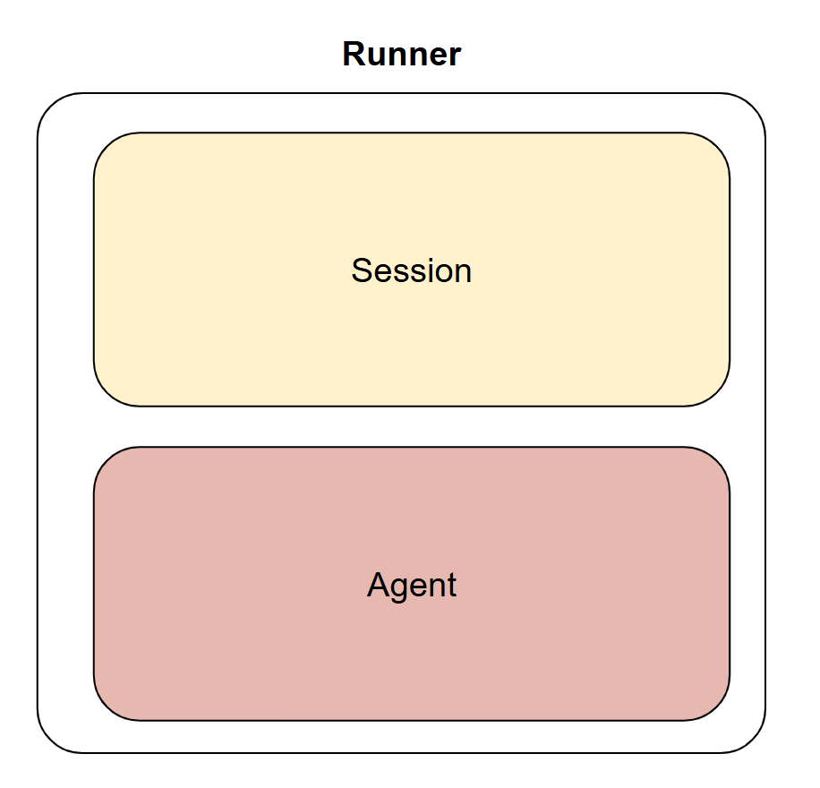
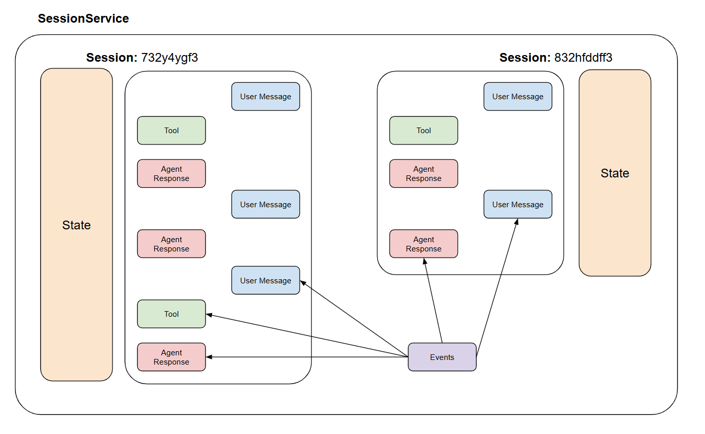

# Session Agents

Before we dive in, two quick notes:

1. Sessions are **quite important**
2. We won’t always be using `adk web` or `adk cli`—especially in production!

**Session:** You can think of a Session as a conversational thread attached to a specific user

**State:** It is a python dictionary representing session memory or the bot's context.

- At create time, we initialize values the agent might need.
- It includes temporary flags, user preferences, conversation steps, etc.

## Key Components

### Agent (🧑‍🍳 Chef)

- Wraps your language model with a prompt template.
- Think of it as the **chef** who follows a recipe with blanks (e.g. `{user_name}`, `{fav_color}`) that get filled in at runtime.
- The chef never forgets to read the recipe before cooking.

### SessionService (🗒️ Notepad)

- Stores per-user, per-session **state** (memory).
- Acts like a **notepad** where you jot down each user’s preferences, counters, or other context.
- Before every response, the chef glances at the notepad to know what ingredients to use.

### Runner (🏃‍♂️ Waiter)

- Orchestrates the entire flow when a user sends a message.
- Grabs the correct **notepad**, hands it and the user’s order to the **chef**, then brings back the chef’s answer.
- Ensures the chef always works with the freshest information.

Visually speaking, a runner can be viewed as this:

<div style="text-align: center;">

</div>

#### Going back to SessionService

There are 3 main types:

1. **InMemorySessionService** - Stores all session data directly in the application's memory. No persistence - meaning data is lost when application is closed.

   - _best for:_ Quick development, local testing, examples, and scenarios where long-term persistence isn't required.

2. **VertexAiSessionService** - Uses Google Cloud's Vertex AI infrastructure via API calls for session management and is persistent.

   - _best for:_ Scalable production applications deployed on Google Cloud, especially when integrating with other Vertex AI features.

3. **DatabaseSessionService** - Connects to a relational database (e.g., PostgreSQL, MySQL, SQLite) to store session data persistently in tables. It is also persistent.
   - _best for:_ Applications needing reliable, persistent storage that you manage yourself.

The above information was taken from [Google ADK Documentation](https://google.github.io/adk-docs/sessions/session/#sessionservice-implementations).

Let's help you build a good visualization:

<div style="text-align: center;">

</div>

## How It Works

1. **Define the Chef**
   - You create an Agent that knows the house recipe and where the blanks go.
2. **Prepare the Notepad**
   - You start a session and write down the user’s info (name, favorite color, etc.).
3. **Call the Waiter**
   - You set up a Runner that ties together the chef, the notepad service, and your app name.
4. **Place an Order**
   - When the user asks a question, the waiter fetches the notepad, gives it to the chef along with the question, and returns the chef’s response.

With this pattern, your **chef** always has the latest **notepad**, and your **waiter** handles the back-and-forth smoothly—no recipe steps get missed!

---

⚠️ We have a problem!

We now know that our LLM cannot update the state automatically.

### Things we can potentially do:

1.💡Manually update the state:

```python
if "change" in user_text and "red" in user_text:
    session.state["fav_color"] = "red"
```

But this could be quite long and prone to human error, especially if there are a lot of attributes

2.💡Use LLM to return structured output:

```python
instruction="""
You are a helpful assistant. You can respond in one of two ways:

1. If the user is asking for information, answer normally.

2. If the user wants to update preferences, reply ONLY with this JSON:
{
  "update_state": {
    "fav_color": "red"
  }
}
Current state:
- name: {name}
- color: {fav_color}
- subject: {fav_subject}
"""
```

This is a better approach but this could still be problematic since LLM outputs are stochastic (we could reduce this by changing temperature)

3.💡Use ADK Tool Calling:

```python
def update_state(key: str, value: str):
    session.state[key] = value
    ...
```

This can be quite complicated to integrate.

4.💡 Structured Outputs:

We will go for this since it is good practice - as we are building on top of what we learnt in a previous section!
